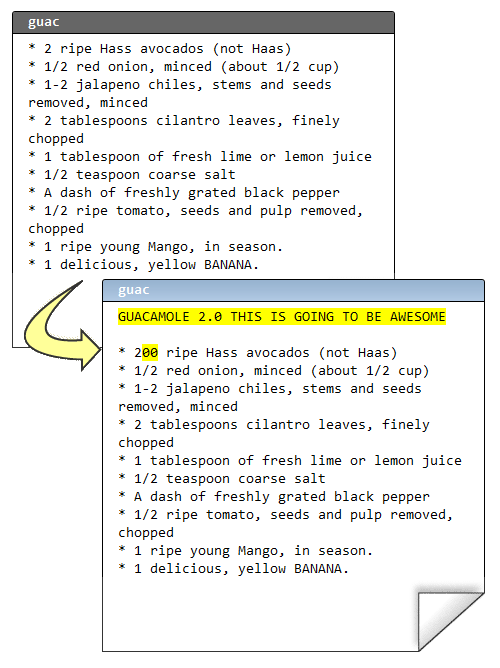
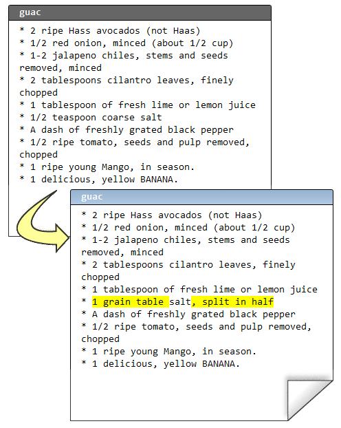

.. epigraph::

    **Mercurial 带给你极具灵活性的版本库组织方式. 由于合并操作如此和谐, 你完全可以信赖合并, 这意味着你可以建立一些特殊用途的版本库, 以匹配你的开发流程.**

================
版本库组织方式
================

我们的配方已经非常完美了::

    C:\Users\joel\recipes> hg log -l 3
    changeset:   13:1b03ab783b17
    tag:         tip
    parent:      12:f923c9049234
    parent:      11:0bd396c9b89b
    user:        Rose Hillman <rose@example.com>
    date:        Thu Feb 11 23:01:55 2010 -0500
    summary:     merge

    changeset:   12:f923c9049234
    parent:      10:8646f8cd7154
    user:        Rose Hillman <rose@example.com>
    date:        Thu Feb 11 22:49:31 2010 -0500
    summary:     mmmmango

    changeset:   11:0bd396c9b89b
    user:        Joel Spolsky <joel@joelonsoftware.com>
    date:        Thu Feb 11 22:46:47 2010 -0500
    summary:     bananas YUM

让我们再来仔细看看变更集编号::

    changeset:   13:1b03ab783b17

编号的第一部分, 13, 简短方便. 但有一个问题... 它很不靠谱!

当团队的每个成员各自开发, 然后合并代码, 这些短编码并未被同步:

.. image:: _images/05-repo.png

所以, 实际上我根本没法跟其他人说 "好, 让我们发布第 13 号变更集的版本吧", 因为他们可能对 13 这个数字有不同的理解. 这就是为什么还有一串古怪的 16 进制编码.

::

    changeset:   13:1b03ab783b17

16 进制编码在所有版本库 **均** 保持一致, 而且永远不会改变.

OK, 我现在可以告诉其他人, "嘿, 我们今天发布! 变更集编号是 1b03ab783b17!" 如果我能给这个变更集取个 *名字* 不是更好?

嗯, 你的确可以. 我们称之为 **标签**.

::

    C:\Users\joel\recipes> hg tag Version-1.0

我们回过来看看日志::

    C:\Users\joel\recipes> hg log -l 2
    changeset:   14:1adc88356f40
    tag:         tip
    user:        Joel Spolsky <joel@joelonsoftware.com>
    date:        Fri Feb 12 09:38:06 2010 -0500
    summary:     Added tag Version-1.0 for changeset 1b03ab783b17

    changeset:   13:1b03ab783b17
    tag:         Version-1.0
    parent:      12:f923c9049234
    parent:      11:0bd396c9b89b
    user:        Rose Hillman <rose@example.com>
    date:        Thu Feb 11 23:01:55 2010 -0500
    summary:     merge

注意, 之前添加标签的动作是一个标准的变更集, 它还帮我自动提交了本次变更. 从现在开始, 每次我要提及发布代码的版本号, 我都可以用 **Version-1.0** 代替 **1b03ab783b17**.

CEO 从 31 楼下来参加官方发布聚会, 还顺带了一整箱看上去相当昂贵的香槟. Stan 有点醉了. 嗯, 醉得不止一点儿. 没人看过他这个样子. 他脱掉了衬衫, 显示他尚未松弛的肌肉, 试图吸引市场部女同事的目光. "我能拉住那些吊灯," 他瞎吹道 (我们有几盏长型荧光吊灯). 接着他一跃而起, 抓住灯座, 然后可想而知了, 整个灯架立马被他拽了下来, 因为那台十磅重的灯座只是用几根细细的钢琴弦吊着, 但这家伙的体重在 290~300 磅之间. 他把整个灯具和天花板部分吊顶给拽了下来, 玻璃和吸声瓦材料破碎一地, 他自己也重重的摔在地板上, 凄惨的叫道他打算起诉公司没有创造一个安全的工作环境.

其他人都回到了各自的办公隔间, 继续开发 鳄梨酱 2.0

提交::

    C:\Users\joel\recipes> hg com -m "more avocado flavor"

显而易见, 配方现在处于非稳定状态. 它没有经过测试或者其它验证. 接着, 某客户一个电话过来.

"这太咸了!" 他悲嗥道. 而且, 他不想等到 2.0 版本才修正这个问题.

幸运的是, 我们之前打了标签. 我可以使用 **hg up** 切换到版本库中的任何版本.

::

    C:\Users\joel\recipes> hg up -r Version-1.0
    1 files updated, 0 files merged, 1 files removed, 0 files unresolved

    C:\Users\joel\recipes> type guac
    * 2 ripe Hass avocados (not Haas)
    * 1/2 red onion, minced (about 1/2 cup)
    * 1-2 jalapeno chiles, stems and seeds removed, minced
    ...

现在我可以开始修正他这个愚蠢的用盐问题了:

接着::

    C:\Users\joel\recipes> hg diff
    diff -r 1b03ab783b17 guac
    --- a/guac      Thu Feb 11 23:01:55 2010 -0500
    +++ b/guac      Fri Feb 12 10:44:19 2010 -0500
    @@ -3,7 +3,7 @@
     * 1-2 jalapeno chiles, stems and seeds removed, minced
     * 2 tablespoons cilantro leaves, finely chopped
     * 1 tablespoon of fresh lime or lemon juice
    -* 1/2 teaspoon coarse salt
    +* 1 grain table salt, split in half
     * A dash of freshly grated black pepper
     * 1/2 ripe tomato, seeds and pulp removed, chopped
     * 1 ripe young Mango, in season.

    C:\Users\joel\recipes> hg com -m "less salt"
    created new head

Mercurial 提醒我创建了一个新的版本头 (head). 现在我们有两个版本头, 2.0 版本头是我不久前创建的, 1.1 版本头是我刚提交的.

.. image:: _images/05-repo-2.png

现在我可以把它发布给客户, 打上 1.1 标签, 然后返回继续 2.0 的开发.

::

    C:\Users\joel\recipes> hg tag -r . Version-1.1

    C:\Users\joel\recipes> hg log -l 3
    changeset:   17:f4220e321145
    tag:         tip
    user:        Joel Spolsky <joel@joelonsoftware.com>
    date:        Fri Feb 12 11:17:02 2010 -0500
    summary:     Added tag Version-1.1 for changeset 60ddc0122eb4

    changeset:   16:60ddc0122eb4
    tag:         Version-1.1
    parent:      13:1b03ab783b17
    user:        Joel Spolsky <joel@joelonsoftware.com>
    date:        Fri Feb 12 10:44:32 2010 -0500
    summary:     less salt

    changeset:   15:90c349eca2e8
    user:        Joel Spolsky <joel@joelonsoftware.com>
    date:        Fri Feb 12 10:31:24 2010 -0500
    summary:     more avocado flavor

    C:\Users\joel\recipes> hg up -r 15
    2 files updated, 0 files merged, 0 files removed, 0 files unresolved

    C:\Users\joel\recipes> type guac
    GUACAMOLE 2.0 THIS IS GOING TO BE AWESOME

    * 200 ripe Hass avocados (not Haas)
    * 1/2 red onion, minced (about 1/2 cup)
    * 1-2 jalapeno chiles, stems and seeds removed, minced
    * 2 tablespoons cilantro leaves, finely chopped
    * 1 tablespoon of fresh lime or lemon juice
    * 1/2 teaspoon coarse salt
    * A dash of freshly grated black pepper
    * 1/2 ripe tomato, seeds and pulp removed, chopped
    * 1 ripe young Mango, in season.
    * 1 delicious, yellow BANANA.
    ...

但还有一个问题... 用盐过量的问题在 2.0 中并未得到修正. 我们该怎么解决呢?

::

    C:\Users\joel\recipes> hg merge
    merging .hgtags

.. image:: _images/05-kdiff3.png

啊哦. 我需要合并标签. 这是 Mercurial 中一个很恶心的 Bug. 主因是 Mercurial 中的标签只是一个文件 - ``.hgtags``, 也被置入版本库进行版本管理, 所以有时你得手工合并不同版本的 ``.hgtags`` 文件. 不论在什么情况下, 你只须做非常简单的处理... 始终保留标签文件 **所有** 版本的每一行.

::

    merging guac
    0 files updated, 2 files merged, 0 files removed, 0 files unresolved
    (branch merge, don't forget to commit)

    C:\Users\joel\recipes> hg diff guac
    diff -r 90c349eca2e8 guac
    --- a/guac      Fri Feb 12 10:31:24 2010 -0500
    +++ b/guac      Fri Feb 12 11:32:43 2010 -0500
    @@ -5,7 +5,7 @@
     * 1-2 jalapeno chiles, stems and seeds removed, minced
     * 2 tablespoons cilantro leaves, finely chopped
     * 1 tablespoon of fresh lime or lemon juice
    -* 1/2 teaspoon coarse salt
    +* 1 grain table salt, split in half
     * A dash of freshly grated black pepper
     * 1/2 ripe tomato, seeds and pulp removed, chopped
     * 1 ripe young Mango, in season.

    C:\Users\joel\recipes> hg com -m "bringing in salt fix from 1.1"

当你只是想对已发布的代码小做计划之外的改动时, 这个简单的方法能让你快速回退到打过标签的版本. 但现实情况是, 对于大部分软件项目, 这类事情会不停的出现, Mercurial 有更稳健的处理方式应对这种情况.

现在我要将刚刚做过的改动全部推倒重来, 让版本库恢复到我刚发布 1.0 版本时的状态, 然后我再向你演示如何非常优雅的修正客户报告的 Bug, 同时不影响未来版本新特性的开发.

::

    C:\Users\joel\recipes> cd ..

    C:\Users\joel> hg clone -r 14 recipes recipes-stable
    requesting all changes
    adding changesets
    adding manifests
    adding file changes
    added 15 changesets with 15 changes to 2 files
    updating to branch default
    2 files updated, 0 files merged, 0 files removed, 0 files unresolved

    C:\Users\joel> cd recipes-stable

    C:\Users\joel\recipes-stable> hg log -l 3
    changeset:   14:1adc88356f40
    tag:         tip
    user:        Joel Spolsky <joel@joelonsoftware.com>
    date:        Fri Feb 12 09:38:06 2010 -0500
    summary:     Added tag Version-1.0 for changeset 1b03ab783b17

    changeset:   13:1b03ab783b17
    tag:         Version-1.0
    parent:      12:f923c9049234
    parent:      11:0bd396c9b89b
    user:        Rose Hillman <rose@example.com>
    date:        Thu Feb 11 23:01:55 2010 -0500
    summary:     merge

    changeset:   12:f923c9049234
    parent:      10:8646f8cd7154
    user:        Rose Hillman <rose@example.com>
    date:        Thu Feb 11 22:49:31 2010 -0500
    summary:     mmmmango

主要思路是, 我们这次不再基于一个版本库执行所有操作, 而是使用两个版本库, 一个叫 **stable**, 另一个称之为 **dev**.

**stable** 版本库托管我们发布给客户的最新重要版本. 每当一个紧急的 Bug 被报告, 我们在 **stable** 中修正它. 本例中, 对应的是 1.0 的相关补丁.

**dev** 版本库则是驶向下一个里程碑的开发活动, 通往 2.0 版本.

一旦 1.0 发布, 我便从 **stable** ``clone`` 一份至 **dev**::

    C:\Users\joel\recipes-stable> cd ..

    C:\Users\joel> hg clone recipes-stable recipes-dev
    updating to branch default
    2 files updated, 0 files merged, 0 files removed, 0 files unresolved

现在我有两个完全一致的版本库:

.. image:: _images/05-repo-3.png

由于这些版本库的历史截止到 14 号变更集为止都是相同的, Mercurial 实际上会使用文件系统的一个内部功能 (硬链接) 避免做实际的复制操作. 这使得 **hg clone** 操作快速而廉价, 所以你不用在一次次的 ``clone`` 操作时纠结了.

现在我们基于 **dev** 版本库继续编辑 ``guac``::

    C:\Users\joel> cd recipes-dev

    C:\Users\joel\recipes-dev> edit guac

    C:\Users\joel\recipes-dev> hg diff
    diff -r 1adc88356f40 guac
    --- a/guac      Fri Feb 12 09:38:06 2010 -0500
    +++ b/guac      Fri Feb 12 15:15:01 2010 -0500
    @@ -1,4 +1,6 @@
    -* 2 ripe Hass avocados (not Haas)
    +GUACAMOLE 2.0 THIS IS GOING TO BE AWESOME
    +
    +* 200 ripe Hass avocados (not Haas)
     * 1/2 red onion, minced (about 1/2 cup)
     * 1-2 jalapeno chiles, stems and seeds removed, minced
     * 2 tablespoons cilantro leaves, finely chopped

    C:\Users\joel\recipes-dev> hg commit -m "more avocado flavor"

接着在 **stable** 版本库中修正用盐过量的问题::

    C:\Users\joel\recipes-dev> cd ..\recipes-stable

    C:\Users\joel\recipes-stable> edit guac

    C:\Users\joel\recipes-stable> hg diff
    diff -r 1adc88356f40 guac
    --- a/guac      Fri Feb 12 09:38:06 2010 -0500
    +++ b/guac      Fri Feb 12 15:18:31 2010 -0500
    @@ -3,7 +3,7 @@
     * 1-2 jalapeno chiles, stems and seeds removed, minced
     * 2 tablespoons cilantro leaves, finely chopped
     * 1 tablespoon of fresh lime or lemon juice
    -* 1/2 teaspoon coarse salt
    +* 1 grain table salt, split in half
     * A dash of freshly grated black pepper
     * 1/2 ripe tomato, seeds and pulp removed, chopped
     * 1 ripe young Mango, in season.

    C:\Users\joel\recipes-stable> hg com -m "less salt"

现在, 我打上标签然后当作 1.1 版本发布::

    C:\Users\joel\recipes-stable> hg tag Version-1.1

此后, 每隔一段时间, 我们定期把 bugfixes 从 stable 取出到 dev::

    C:\Users\joel\recipes-stable> cd ..\recipes-dev

    C:\Users\joel\recipes-dev> hg in
    comparing with c:\Users\joel\recipes-stable
    searching for changes
    changeset:   15:e05c954f961f
    tag:         Version-1.1
    user:        Joel Spolsky <joel@joelonsoftware.com>
    date:        Fri Feb 12 15:28:27 2010 -0500
    summary:     less salt

    changeset:   16:f0e8768829ed
    tag:         tip
    user:        Joel Spolsky <joel@joelonsoftware.com>
    date:        Fri Feb 12 15:28:40 2010 -0500
    summary:     Added tag Version-1.1 for changeset e05c954f961f

    C:\Users\joel\recipes-dev> hg pull
    pulling from c:\Users\joel\recipes-stable
    searching for changes
    adding changesets
    adding manifests
    adding file changes
    added 2 changesets with 2 changes to 2 files (+1 heads)
    (run 'hg heads' to see heads, 'hg merge' to merge)

    C:\Users\joel\recipes-dev> hg merge
    merging guac
    0 files updated, 1 files merged, 0 files removed, 0 files unresolved
    (branch merge, don't forget to commit)

    C:\Users\joel\recipes-dev> hg com -m "merge"

    C:\Users\joel\recipes-dev> type guac
    GUACAMOLE 2.0 THIS IS GOING TO BE AWESOME

    * 200 ripe Hass avocados (not Haas)
    * 1/2 red onion, minced (about 1/2 cup)
    * 1-2 jalapeno chiles, stems and seeds removed, minced
    * 2 tablespoons cilantro leaves, finely chopped
    * 1 tablespoon of fresh lime or lemon juice
    * 1 grain table salt, split in half
    * A dash of freshly grated black pepper
    * 1/2 ripe tomato, seeds and pulp removed, chopped
    * 1 ripe young Mango, in season.
    * 1 delicious, yellow BANANA.

    Smoosh all ingredients together.
    Serve with tortilla chips.

这就是我们的成果:

.. image:: _images/05-repo-4.png

嗯, 如果你看懂了这张 *令人抓狂* 的图, 你离真正理解 Mercurial 为时不远了. 本例的要旨是, stable 版本库最终只包含 bugfixes, 而 dev 版本库包含了新的代码和合并入的 bugfixes.

多版本库的使用方式还有很多.

* 你可以建立一个团队版本库, 用于部分成员协作开发一个新特性. 当他们完成开发而且可以跑起来了, 你再把变更从团队库推送至中央开发库, 让其他成员都能得到该功能.

* 你可以为测试人员建立一个 QA 版本库. 开发人员把测试过的代码推送到 QA 版本库, 而不是中央库. 一旦测试人员核准, 便可从 QA 版本库推送至中央开发库. 这样中央库的代码都将是已测试过的代码.

* 由于每个开发人员有他们自己的本地库, 你可以从同事那儿直接获取试验性的变更集进行联调, 避免变更牵连团队的其他成员.

在大型, 复杂的组织内, 你可以组合以上技巧, 建立一堆的版本库, 然后相互 ``pull``. 随着每个特性逐级进行测试和集成, 新特性沿着下面的树型结构中被越送越高, 直到新的代码抵达中央发布库, 可以交付给客户:

.. image:: _images/05-complex.png

小测验
----------

下面的一些操作是学完本章教程后, 你应该要学会的:

#. 给历史版本打上标签, 然后退回到此版本

#. 用 "stable" 和 "dev" 版本库组织你的团队

嗯, 不知不觉我们的教程接近尾声了. 我尚未能 *涉及* 到 Mercurial 的方方面面, 但是有大量资料会帮助你更深入的去挖掘. 有 `一本书 <http://hgbook.red-bean.com/>`_ 涵盖了 Mercurial 的所有功能和完整细节. 而且如果你有任何疑问, 我都毫不犹豫的邀请你访问 `Kiln Knowledge Exchange <http://kiln.stackexchange.com/>`_ (它和 `StackOverflow <http://stackoverflow.com/>`_ 很像, 但只有 Kiln 和 Mercurial 相关问题才会受到关注和欢迎.)

(译注: Kiln 和 StackOverflow 都是 Joel Spolsky 所在公司的产品, Joel 趁势打了个广告 :) )
