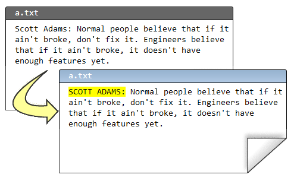
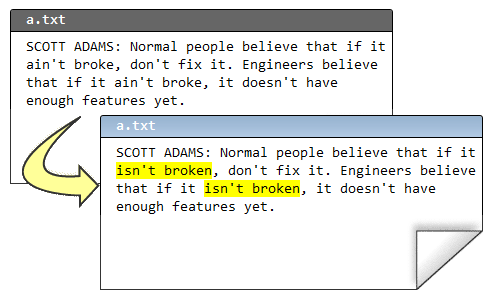
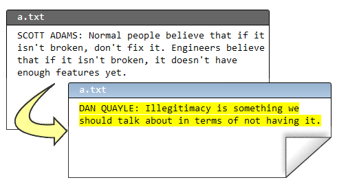

.. epigraph::

    **即便你是一个人在战斗, 你也应该使用 Mercurial 并从版本控制中获益. 下面的指南会告诉你把一个目录提交到 Mercurial 并追根溯源, 是一件多么简单的事情.**

=======================
Mercurial 从零开始
=======================

Mercurial 是一个 *版本控制系统*. 开发者可以用它来管理源代码. 它的主要有两大功能:

#. 它保留每个文件的所有变更/编辑历史

#. 它能够合并源码的改动, 这样你的队友可以各自编码, 然后合并他们的变更

如果不用 Mercurial, 你就得很土的去保存 N 多份代码拷贝:

.. image:: _images/01-copies.png

这么做太土了, 占用了大量的硬盘空间, 而且混乱不堪. 使用版本控制会是更好的方法.

大部分人在命令行下使用 Mercurial, 命令行在 Windows, Unix, 和 Mac 下都可以很好的工作. 执行 Mercurial 的命令是 **hg**::

    c:\hginit> hg
    Mercurial Distributed SCM
                                    
    basic commands:
                                    
    add        add the specified files on the next commit
    annotate   show changeset information by line for each file
    clone      make a copy of an existing repository
    commit     commit the specified files or all outstanding changes
    diff       diff repository (or selected files)
    export     dump the header and diffs for one or more changesets
    forget     forget the specified files on the next commit
    init       create a new repository in the given directory
    log        show revision history of entire repository or files
    merge      merge working directory with another revision
    pull       pull changes from the specified source
    push       push changes to the specified destination
    remove     remove the specified files on the next commit
    serve      export the repository via HTTP
    status     show changed files in the working directory
    summary    summarize working directory state
    update     update working directory
                                    
    use "hg help" for the full list of commands or "hg -v" for details

单单输入 **hg** 不加任何选项, 会列出最常用的命令. 你也可以试试 **hg help** 来得到完整的命令列表.

要利用版本控制的优势, 你需要一个 *版本库*. 版本库保存了每个文件的所有历史版本. 为了节约硬盘空间, 它实际上不会保存所有的历史版本 -- 它只是保存了一份紧凑的变更列表.

在以往的岁月, 要创建一个版本库可是件大事. 你需要一个中央服务器, 还要在它上面装上相应的软件. Mercurial 是 *分布式* 的, 所以你不用买昂贵的中央服务器就可以使用它. 你能在自己的 PC 上使用它的全部功能. 而且创建一个版本库也超级简单: 只需要切换到源码所在的根目录...::

    c:\hginit> cd CountDown

    c:\hginit\CountDown> dir /w
     Volume in drive C has no label.
     Volume Serial Number is 9862-36C5

     Directory of c:\hginit\CountDown

    [.]                       [..]                      a.txt
    AlternateMessages.xml     App.config                App.xaml
    App.xaml.cs               CountDown.xaml            CountDown.xaml.cs
    DevDaysCountDown.csproj   favicon.ico               [Images]
    [Properties]              [TweetSharp]
                   9 File(s)        155,932 bytes
                   5 Dir(s)  76,083,609,600 bytes free

``hg init``
-----------------

.. note:: ``hg init``
    
    创建一个版本库

... 这就是我的代码, 然后键入 **hg init**::

    c:\hginit\CountDown> hg init

    c:\hginit\CountDown>

等一下, 你做了什么? 看上去啥事都没干啊? 如果你有仔细观察, 你会发现已经创建了一个新的隐藏目录 -- **.hg**::

    c:\hginit\CountDown> dir /w
     Volume in drive C has no label.
     Volume Serial Number is 9862-36C5

     Directory of c:\hginit\CountDown

    [.]                       [..]                      [.hg]
    a.txt                     AlternateMessages.xml     App.config
    App.xaml                  App.xaml.cs               CountDown.xaml
    CountDown.xaml.cs         DevDaysCountDown.csproj   favicon.ico
    [Images]                  [Properties]              [TweetSharp]
                   9 File(s)        155,932 bytes
                   6 Dir(s)  76,083,650,560 bytes free

那个目录就是版本库! 这个目录包含了 Mercurial 所需要的一切. 配置, 文件的历史版本, 标签, 雨天的备用袜之类的. *别到那个目录搞破坏*. 你可能永远都不会想到去乱操作那个目录.

``hg add``
----------------

.. note:: ``hg add``
    
    将文件放到入库等候队列中. 它们在你执行 ``commit`` 操作之前实际上是不会入版本库的

好, 现在我们有一个全新的版本库, 我们准备把所有源文件添加进去. 这很简单: 只需要键入 **hg add**.

::

    c:\hginit\CountDown> hg add
    adding AlternateMessages.xml
    adding App.config
    adding App.xaml
    adding App.xaml.cs
    adding CountDown.xaml
    adding CountDown.xaml.cs
    adding DevDaysCountDown.csproj
    adding Images\background_city.jpg
    adding Images\carsonified_presents.png
    adding Images\darkpanel.png
    adding Images\devdays.png
    adding Images\failwhale.png
    adding Images\holding_image.jpg
    adding Images\jeff_atwood.jpg
    adding Images\joel_spolsky.jpg
    adding Images\logo_stackoverflow.png
    adding Images\matt_lacey.jpg
    adding Images\sideDarkpanel.png
    adding Images\vertical_lines2.png
    adding Properties\AssemblyInfo.cs
    adding Properties\Resources.Designer.cs
    adding Properties\Resources.resx
    adding Properties\Settings.Designer.cs
    adding Properties\Settings.settings
    adding TweetSharp\Dimebrain.TweetSharp.dll
    adding TweetSharp\Dimebrain.TweetSharp.xml
    adding TweetSharp\Newtonsoft.Json.dll
    adding a.txt
    adding favicon.ico

还有一个额外的步骤... 你需要 *提交* 你的变更. 什么变更? 添加所有这些文件即为一次变更.

``hg commit``
-------------------

.. note:: ``hg commit``
    
    把当前所有文件的状态保存到版本库

为什么你必须提交? 对于 Mercurial, 提交意味着 "嘿, 这些文件现在是这个状态 -- 请记牢咯." 这就像是备份了整个目录... 每次你做了类似的变更, 都需要提交.

::

    c:\hginit\CountDown> hg commit

Mercurial 会弹出一个编辑器让你输入提交摘要. 提交摘要只是方便日后提示你本次提交做了哪些改动.

.. image:: _images/01-commit0.png

当你保存并退出后, 你所有的源文件都将被提交.

``hg log``
-------------------

.. note:: ``hg log``
    
    显示已经提交到版本库的变更历史

你可以键入 **hg log** 查看提交历史. 你可以把它想象成版本库的 Blog::
    
    c:\hginit\CountDown> hg log
    changeset:   0:da5f372c3901
    tag:         tip
    user:        Joel Spolsky <joel@joelonsoftware.com>
    date:        Fri Feb 05 13:04:30 2010 -0500
    summary:     Initial version of the CountDown code

我们编辑一个文件, 然后看看会发生什么.

现在, 我们修改了文件 ``a.txt``, 可以用 **hg commit** 进行提交::

    c:\hginit\CountDown> hg commit

注意 Mercurial 检查到只有一个文件 ``a.txt`` 被修改了:

.. image:: _images/01-commit1.png

让我们看看提交后, 日志的显示情况::

    c:\hginit\CountDown> hg log
    changeset:   1:a9497f468dc3
    tag:         tip
    user:        Joel Spolsky <joel@joelonsoftware.com>
    date:        Fri Feb 05 13:26:13 2010 -0500
    summary:     Capitalized "Scott Adams"
    
    changeset:   0:da5f372c3901
    user:        Joel Spolsky <joel@joelonsoftware.com>
    date:        Fri Feb 05 13:04:30 2010 -0500
    summary:     Initial version of the CountDown code

和现在流行的 Blog 系统一样, Mercurial 把最新的内容放在最上面.

接下来我还要做一个变更, 就当是自娱自乐吧.

提交::

    c:\hginit\CountDown> hg commit

我的提交摘要:

.. image:: _images/01-commit2.png

现在日志显示成啥样? ::

    c:\hginit\CountDown> hg log
    changeset:   2:55490459b740
    tag:         tip
    user:        Joel Spolsky <joel@joelonsoftware.com>
    date:        Fri Feb 05 13:47:43 2010 -0500
    summary:     Fixed some grammar
    
    changeset:   1:a9497f468dc3
    user:        Joel Spolsky <joel@joelonsoftware.com>
    date:        Fri Feb 05 13:26:13 2010 -0500
    summary:     Capitalized "Scott Adams"
    
    changeset:   0:da5f372c3901
    user:        Joel Spolsky <joel@joelonsoftware.com>
    date:        Fri Feb 05 13:04:30 2010 -0500
    summary:     Initial version of the CountDown code

OK, 这很有趣. 我做了一些变更, 并且每次我做了一个有意义的变更, 我便提交到版本库.

我知道你在想什么. 你在想, "JOEL, 这整一个就是浪费时间." 为什么提交的时候尽是些罗里罗嗦的废话?

耐心, 年轻人. 你马上就会学到如何从中获益.

NO1. 我们假设你编辑的时候犯了一个重大失误.

接着, 我嘞个去, 你又删掉了几个非常重要的文件.

::

    c:\hginit\CountDown> del favicon.ico
    
    c:\hginit\CountDown> del App.xaml

在没有 Mercurial 的那些岁月, 这是一个跑去向系统管理哭诉大好机会, 你还可以凄惨的质问 *为什么* 备份系统 "临时" 罢工了, 而且已经八个月了.

系统管理员 (大家都叫他 Taco), 很害羞一小伙, 从不和团队的其他成员共进午餐. 偶尔他离开他那心爱的办公转椅, 你会看到座位上有个三角形状的沙司色的污渍, 那是他经常吃墨西哥午餐, 掉在他两腿间油滴... 肯定没人会拖走他的椅子, 即使它是公司创始人给自己买的 Herman Miller 公司豪配系列, 而不是把其他人弄得背痛的 Staples $99 标配特价版.

反正, 就是没有备份.

``hg revert``
-------------------

.. note:: ``hg revert``
    
    将变更的文件恢复到最近一次提交后的状态

感谢 Mercurial, 当你想反悔时, 你可以使用快捷的 **hg revert** 命令, 立刻将你的目录恢复到最后一次提交之后的状态.

::

    c:\hginit\CountDown> hg revert --all
    reverting App.xaml
    reverting a.txt
    reverting favicon.ico
    
    c:\hginit\CountDown> type a.txt
    SCOTT ADAMS: Normal people believe that if it isn't
    broken, don't fix it. Engineers believe that if it
    isn't broken, it doesn't have enough features yet.

我使用了命令行参数 **--all**, 这是因为我希望把 *所有* 文件都恢复到原来的状态.

所以, 用 Mercurial 管理代码时:

#. 做些代码修改
#. 看是否能正常运行
#. 可以, 则 **commit** 变更
#. 不行, 则 **revert** 它们
#. GOTO 1

(我明白. 还停留在 Windows 命令提示符和 GOTO 语句, 我是有史以来最矬的程序员)

``hg status``
-------------------

.. note:: ``hg status``
    
    显示改动过的文件列表

随着时间推移, 你可能会困惑现在身处何处, 还有自从最后一次提交, 你做了哪些变更. Mercurial 帮你追踪所有操作. 你所需要做的只是键入 **hg status**, Mercurial 便会为你提供一份变更的文件列表.

假如我创建了一个文件, 编辑了一个文件, 同时删除了一个文件.

::

    c:\hginit\CountDown> copy a.txt b.txt
            1 file(s) copied.
    
    c:\hginit\CountDown> notepad2 a.txt
    
    c:\hginit\CountDown> del favicon.ico
    
    c:\hginit\CountDown> hg status
    M a.txt
    ! favicon.ico
    ? b.txt

**hg status** 会列出所有改动过的文件, 并在每行用一个字符指代变更类型. "M" 表示 "Modified" -- 文件已经被修改. "!" 表示丢失 -- 文件原本应该在那儿, 但是不见了. "?" 表示未知 -- 该文件尚未被 Mercurial 管理, 版本库里没有任何信息.

让我们逐个处理这些变更. 那个被修改的文件, **a.txt**. 做了哪些改动? 你可能已经忘记的一干二净了! 嘿, 我有几天连我早餐吃了些啥都不记得. 更令我焦虑的实际上是每天都是麦片. 反正, a.txt 就是被修改了. 那到底改了些啥?

``hg diff``
-------------------

.. note:: ``hg diff``
    
    显示一个文件的改动详情

有条命令可以为你提供答案: **hg diff** 会告诉你文件自最后一次提交后具体做了哪些改动.

::

    c:\hginit\CountDown> hg diff a.txt
    diff -r 55490459b740 a.txt
    --- a/a.txt     Fri Feb 05 13:47:43 2010 -0500
    +++ b/a.txt     Fri Feb 05 14:31:18 2010 -0500
    @@ -1,3 +1,3 @@
    -SCOTT ADAMS: Normal people believe that if it isn't
    +SCOTT ADAMS: Civilians believe that if it isn't
     broken, don't fix it. Engineers believe that if it
     isn't broken, it doesn't have enough features yet.

格式看上去挺神秘的, 但更有意思的是: 以减号开头的是那些被删除的行, 以加号开头的则是增加的行, 所以上面的信息表明 "Normal people" 被修改成 "Civilians".

``hg remove``
-------------------

.. note:: ``hg remove``
    
    将文件放到出库等候队列中. 它们在你执行 ``commit`` 操作之前实际上是不会从版本库移除的

我们再来看看那个丢失的文件, ``favicon.ico``. 如之前所说, 如果你没打算删除它, 你可以用 **hg revert** 命令. 我们假设你就是想移除它. 每当移除 (或添加) 一个文件, 你都需要通知到 Mercurial:

::

    c:\hginit\CountDown> hg remove favicon.ico
    
    c:\hginit\CountDown> hg status
    M a.txt
    R favicon.ico
    ? b.txt

"R" 表示 "Removed", 这样下次我们执行提交操作, ``favicon.ico`` 便会从 Mercurial 版本库中删除. (文件的 *历史数据* 仍然保存在版本库中, 自然我们可以随时把它恢复回来).

最后, 我们再来处理那个新增的文件 **b.txt**::

    c:\hginit\CountDown> hg add
    adding b.txt
    
    c:\hginit\CountDown> hg st
    M a.txt
    A b.txt
    R favicon.ico

"A" 表示 "Added". 另外你注意到了吗? 我已经懒得每次都完整的键入 **hg status** 了. 只要不产生冲突, Mercurial 不需要键入完整的命令 -- 除了 **status** 没有其它命令是以 **st** 开头的.

在解决完所有的 ``?`` 和 ``!`` 后, 我们可以继续提交变更了::

    c:\hginit\CountDown> hg commit

    c:\hginit\CountDown> hg log
    changeset:   3:2f4718ee168e
    tag:         tip
    user:        Joel Spolsky <joel@joelonsoftware.com>
    date:        Fri Feb 05 14:54:45 2010 -0500
    summary:     A few highly meaningful changes. No favicon.ico no more.
    
    changeset:   2:55490459b740
    user:        Joel Spolsky <joel@joelonsoftware.com>
    date:        Fri Feb 05 13:47:43 2010 -0500
    summary:     Fixed some grammar
    
    changeset:   1:a9497f468dc3
    user:        Joel Spolsky <joel@joelonsoftware.com>
    date:        Fri Feb 05 13:26:13 2010 -0500
    summary:     Capitalized "Scott Adams"
    
    changeset:   0:da5f372c3901
    user:        Joel Spolsky <joel@joelonsoftware.com>
    date:        Fri Feb 05 13:04:30 2010 -0500
    summary:     Initial version of the CountDown code

**hg log** 的输出结果带来另外一个问题: 每次提交 *changeset* 一行都会显示一个编号... 事实上是两个: 一个比较直观简洁, 比如初始版本编号 "0", 但另外一个是冗长, 诡异的十六进制编码, 不过你可以暂时无视它.

谨记 Mercurial 在版本库中存储了足够的信息来重建任何文件的历史版本.

``hg cat``
-------------------

.. note:: ``hg cat``
    
    显示任何文件的任何版本

首先, 一条简单的 **hg cat** 命令可以用来显示一个文件的任何历史版本. 比如, 想知道 ``a.txt`` 有啥内容::

    c:\hginit\CountDown> hg cat a.txt
    SCOTT ADAMS: Civilians believe that if it isn't
    broken, don't fix it. Engineers believe that if it
    isn't broken, it doesn't have enough features yet.

要想知道它以往的内容, 我们可以从日志里挑一个变更集编号. 然后用 **-r** ("revision") 参数配合 **cat** 命令::

    c:\hginit\CountDown> hg cat -r 0 a.txt
    Scott Adams: Normal people believe that if it ain't
    broke, don't fix it. Engineers believe that if it
    ain't broke, it doesn't have enough features yet.

如果文件冗长复杂, 而且只做了非常小的改动, 我们可以用 **-r** 参数配合 **hg diff** 命令, 输出任意两个版本之间的区别. 比如, 让我们看看版本 0 和 1 之间做了哪些修改::

    c:\hginit\CountDown> hg diff -r 0:1 a.txt
    diff -r da5f372c3901 -r a9497f468dc3 a.txt
    --- a/a.txt     Fri Feb 05 13:04:30 2010 -0500
    +++ b/a.txt     Fri Feb 05 13:26:13 2010 -0500
    @@ -1,3 +1,3 @@
    -Scott Adams: Normal people believe that if it ain't
    +SCOTT ADAMS: Normal people believe that if it ain't
     broke, don't fix it. Engineers believe that if it
     ain't broke, it doesn't have enough features yet.

``hg update``
-------------------

.. note:: ``hg update``
    
    将工作目录更新到指定版本

最后, 如果你还没有精疲力尽到昏厥, 我在本章结束前还想讲讲 *另外一个小功能*: 你可以用 **hg update** 命令在任何历史版本间来回时空穿梭. 当然, *本质上* 你是不能飞跃到未来的, 虽然我们都知道这肯定是一件非常酷的事儿. 如果你只有四个版本, 在敲入 **hg update -r 103994** 后立马得到一些很酷的, 反万有引力, 科幻式的未来版本源码. 别做梦了, 这是不可能的.

但追溯任何版本都是可能的. 比如::

    c:\hginit\CountDown> hg update -r 0
    2 files updated, 0 files merged, 1 files removed, 0 files unresolved
    
    c:\hginit\CountDown> type a.txt
    Scott Adams: Normal people believe that if it ain't
    broke, don't fix it. Engineers believe that if it
    ain't broke, it doesn't have enough features yet.
    
    c:\hginit\CountDown> hg up -r 1
    1 files updated, 0 files merged, 0 files removed, 0 files unresolved
    
    c:\hginit\CountDown> type a.txt
    SCOTT ADAMS: Normal people believe that if it ain't
    broke, don't fix it. Engineers believe that if it
    ain't broke, it doesn't have enough features yet.
    
    c:\hginit\CountDown> hg up
    2 files updated, 0 files merged, 1 files removed, 0 files unresolved
    
    c:\hginit\CountDown> type a.txt
    SCOTT ADAMS: Civilians believe that if it isn't
    broken, don't fix it. Engineers believe that if it
    isn't broken, it doesn't have enough features yet.

**hg update** 命令实际上是修改目录下的所有文件内容达到按时间来回穿梭的效果. 如果需要添加或移除一个文件, **hg update** 命令也会照做. **hg update** 不带任何参数的话, 即默认为最新版本.

小测验
----------

OK! 以上就是本章的教程. 接下来的几个知识点你现在应该都知道怎么操作了:

#. 创建一个版本库

#. 从版本库中添加和移除文件

#. 做些修改, 然后看看你做了哪些尚未提交的改动, 然后

#. ... 如果你愿意, 就提交这些变更.

#. ... 或者你也可以不提交, 恢复 (revert) 这些变更

#. 查看一下这些文件历史版本, 甚至让你的目录来个时空穿梭

Next
----------

:doc:`接下来, 我们将会看到整个团队如何使用 Mercurial 协作开发 </setting-up>`

