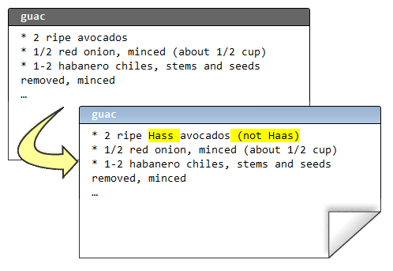
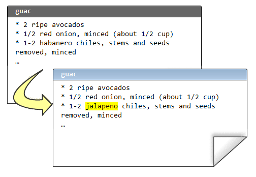
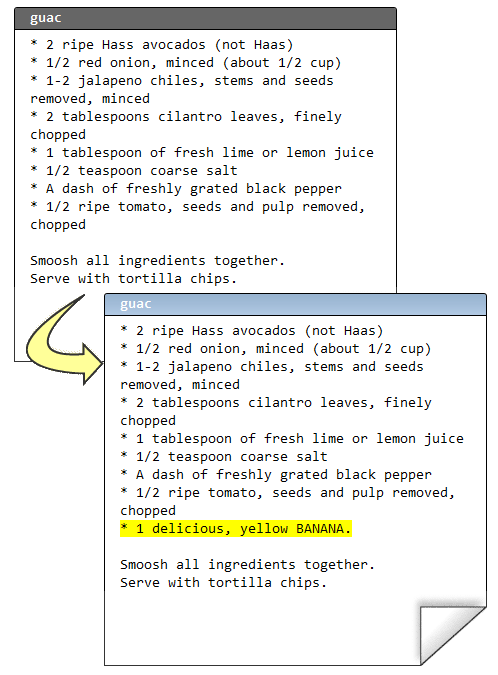

.. epigraph::

    **合并有时会产生冲突. 通常这些冲突很容易解决, 你也必须得去解决, 不然你的版本库就会变成多头怪 (多个最新版本). 有谁希望自己肩膀上扛着好几个脑袋?**

================
合并
================

版本管理的一个重要功能是帮助多人团队进行协同代码开发.

假设 Rose 和我都想修改鳄梨酱的配方. Rose 想提高鳄梨的品质标准. 于是她把中央库最新的变更都获取了下来, 现在她的本地库是最新的:

.. code-block:: bash

    C:\Users\rose\recipes> hg pull
    pulling from http://joel.example.com:8000/
    searching for changes
    adding changesets
    adding manifests
    adding file changes
    added 2 changesets with 2 changes to 1 files
    (run 'hg update' to get a working copy)

    C:\Users\rose\recipes> hg up
    1 files updated, 0 files merged, 0 files removed, 0 files unresolved

然后编辑:

(译注: Hass avocados - 哈斯鳄梨)

接着, 她提交改动并把变更推送到中央版本库:

.. code-block:: bash

    C:\Users\rose\recipes> hg diff
    diff -r 549d45f24c37 guac
    --- a/guac      Thu Feb 11 17:07:41 2010 -0500
    +++ b/guac      Thu Feb 11 17:10:40 2010 -0500
    @@ -1,4 +1,4 @@
    -* 2 ripe avocados
    +* 2 ripe Hass avocados (not Haas)
     * 1/2 red onion, minced (about 1/2 cup)
     * 1-2 habanero chiles, stems and seeds removed, minced
     * 2 tablespoons cilantro leaves, finely chopped

    C:\Users\rose\recipes> hg com -m "better avocados"

    C:\Users\rose\recipes> hg push
    pushing to http://joel.example.com:8000/
    searching for changes
    adding changesets
    adding manifests
    adding file changes
    added 1 changesets with 1 changes to 1 files

而与此同时, 我在文件的另外一处也做了修改:

提交没问题, 但是我不能推送到中央库.

::

    C:\Users\joel\recipes> hg diff
    diff -r 549d45f24c37 guac
    --- a/guac      Thu Feb 11 17:07:41 2010 -0500
    +++ b/guac      Thu Feb 11 17:12:09 2010 -0500
    @@ -1,6 +1,6 @@
     * 2 ripe avocados
     * 1/2 red onion, minced (about 1/2 cup)
    -* 1-2 habanero chiles, stems and seeds removed, minced
    +* 1-2 jalapeno chiles, stems and seeds removed, minced
     * 2 tablespoons cilantro leaves, finely chopped
     * 1 tablespoon of fresh lime or lemon juice
     * 1/2 teaspoon coarse salt

    C:\Users\joel\recipes> hg com -m "better chile"

    C:\Users\joel\recipes> hg push
    pushing to http://joel.example.com:8000/
    searching for changes
    abort: push creates new remote heads!
    (did you forget to merge? use push -f to force)

这可以说是 Mercurial 里面最没有意义的错误提示. 它应该这么说::

    C:\Users\joel\recipes> hg push
    pushing to http://joel.example.com:8000/
    searching for changes
    ZOMG!!! There are changes in that repo that you don't have yet.
    Don't push now. Pull the latest changes and merge them first.

而且我的确打算这么做::

    C:\Users\joel\recipes> hg pull
    pulling from http://joel.example.com:8000/
    searching for changes
    adding changesets
    adding manifests
    adding file changes
    added 1 changesets with 1 changes to 1 files (+1 heads)
    (run 'hg heads' to see heads, 'hg merge' to merge)

想知道获取了哪些东西? **hg log -P .** 命令可以方便的让你知道.

::

    C:\Users\joel\recipes> hg log -P .
    changeset:   9:44aefdeef9e0
    tag:         tip
    parent:      7:549d45f24c37
    user:        Rose Hillman <rose@example.com>
    date:        Thu Feb 11 17:10:48 2010 -0500
    summary:     better avocados

实际上获取下来的是 Rose 之前所作的变更. 我的本地库现在是什么状态?

::

    C:\Users\joel\recipes> hg heads
    changeset:   9:44aefdeef9e0
    tag:         tip
    parent:      7:549d45f24c37
    user:        Rose Hillman <rose@example.com>
    date:        Thu Feb 11 17:10:48 2010 -0500
    summary:     better avocados

    changeset:   8:bf5854ca20f7
    user:        Joel Spolsky <joel@joelonsoftware.com>
    date:        Thu Feb 11 17:12:23 2010 -0500
    summary:     better chile

    C:\Users\joel\recipes> hg parent
    changeset:   8:bf5854ca20f7
    user:        Joel Spolsky <joel@joelonsoftware.com>
    date:        Thu Feb 11 17:12:23 2010 -0500
    summary:     better chile

我有 "多个版本头 (multiple heads)". 我的本地库现在应该是这个样子地::

.. image:: _images/04-repo.png

看到 "双头" 了吗? 这是因为我和 Rose 都是在工作目录下的 7 号变更集的基础上进行修改. *所以现在必须要合并*.

::

    C:\Users\joel\recipes> hg merge
    merging guac
    0 files updated, 1 files merged, 0 files removed, 0 files unresolved
    (branch merge, don't forget to commit)

    C:\Users\joel\recipes> hg log -l 4
    changeset:   10:8646f8cd7154
    tag:         tip
    parent:      8:bf5854ca20f7
    parent:      9:44aefdeef9e0
    user:        Joel Spolsky <joel@joelonsoftware.com>
    date:        Thu Feb 11 21:51:26 2010 -0500
    summary:     merge

    changeset:   9:44aefdeef9e0
    parent:      7:549d45f24c37
    user:        Rose Hillman <rose@example.com>
    date:        Thu Feb 11 17:10:48 2010 -0500
    summary:     better avocados

    changeset:   8:bf5854ca20f7
    user:        Joel Spolsky <joel@joelonsoftware.com>
    date:        Thu Feb 11 17:12:23 2010 -0500
    summary:     better chile

    changeset:   7:549d45f24c37
    parent:      5:d8b5146ab630
    parent:      6:470aea67ee96
    user:        Joel Spolsky <joel@joelonsoftware.com>
    date:        Thu Feb 11 17:07:41 2010 -0500
    summary:     undo thing from the past

合并命令 - **hg merge** 把两个栈顶变更集进行合并. 然后它会把合并结果保存到工作目录. 它不会尝试提交, 留给我一个检查合并是否正确的机会::

    C:\Users\joel\recipes> type guac
    * 2 ripe Hass avocados (not Haas)
    * 1/2 red onion, minced (about 1/2 cup)
    * 1-2 jalapeno chiles, stems and seeds removed, minced
    * 2 tablespoons cilantro leaves, finely chopped
    * 1 tablespoon of fresh lime or lemon juice
    * 1/2 teaspoon coarse salt
    * A dash of freshly grated black pepper
    * 1/2 ripe tomato, seeds and pulp removed, chopped

    Smoosh all ingredients together.
    Serve with tortilla chips.

    This recipe is really good served with QUESO.

    QUESO is Spanish for "cheese," but in Texas,
    it's just Kraft Slices melted in the microwave
    with some salsa from a jar. MMM!

嗯, 没错; 鳄梨是哈斯的 (Hass avocados), 红番椒是墨西哥的 (Jalapeno chiles). 我决定提交合并, 并推送到中央库服务器.

::

    C:\Users\joel\recipes> hg com -m "merge"

    C:\Users\joel\recipes> hg push
    pushing to http://joel.example.com:8000/
    searching for changes
    adding changesets
    adding manifests
    adding file changes
    added 2 changesets with 2 changes to 1 files

我推送了两个变更集: 我原来的 "墨西哥红番椒" (Jalapeno chiles) 改动, 以及后来的合并结果 (也被当作独立的变更集).

注意我们两次变更并没有冲突, 因为 Rose 和我修改的不是同一个地方. 所以合并过程超级简单. 这是最常见的情况, 大部分团队, 每个开发人员一般都会分配到不同的模块代码.

如果你不幸处在一个奇怪的团队, 没人愿意承担明确的开发职责. 这会导致开发人员之间常常出现突发性的悲观情绪. 这种情绪很难被察觉. 临床症状包括: 开发人员把自个儿锁在浴室; 或者锁在机房; 人员流失严重; 在小隔间里默默啜泣; 以及长时间处于军用来复枪枪击声场下引起突发性的耳膜损伤.

但即便你身处最伟大, 最健全的组织, 合并冲突有时还是会发生, Mercurial 会要求你解决冲突. 让我们看看应该怎么做.

首先... 我让 Rose 继续改进我的 "墨西哥红番椒" (Jalapeno chiles) 变更:

.. code-block:: bash

    C:\Users\rose\recipes> hg in
    comparing with http://joel.example.com:8000/
    searching for changes
    changeset:   9:bf5854ca20f7
    parent:      7:549d45f24c37
    user:        Joel Spolsky <joel@joelonsoftware.com>
    date:        Thu Feb 11 17:12:23 2010 -0500
    summary:     better chile

    changeset:   10:8646f8cd7154
    tag:         tip
    parent:      9:bf5854ca20f7
    parent:      8:44aefdeef9e0
    user:        Joel Spolsky <joel@joelonsoftware.com>
    date:        Thu Feb 11 21:51:26 2010 -0500
    summary:     merge

    C:\Users\rose\recipes> hg pull
    pulling from http://joel.example.com:8000/
    searching for changes
    adding changesets
    adding manifests
    adding file changes
    added 2 changesets with 2 changes to 1 files
    (run 'hg update' to get a working copy)

    C:\Users\rose\recipes> hg up
    1 files updated, 0 files merged, 0 files removed, 0 files unresolved

现在我们看看当碰到该死的冲突时会发生些什么: 我们将在配料上动点手脚.

我先往配方中添加一个香蕉:

紧接着提交本次变更::

    C:\Users\joel\recipes> hg diff
    diff -r 8646f8cd7154 guac
    --- a/guac      Thu Feb 11 21:51:26 2010 -0500
    +++ b/guac      Thu Feb 11 22:46:27 2010 -0500
    @@ -6,6 +6,7 @@
     * 1/2 teaspoon coarse salt
     * A dash of freshly grated black pepper
     * 1/2 ripe tomato, seeds and pulp removed, chopped
    +* 1 delicious, yellow BANANA.

     Smoosh all ingredients together.
     Serve with tortilla chips.

    C:\Users\joel\recipes> hg com -m "bananas YUM"

    C:\Users\joel\recipes> hg push
    pushing to http://joel.example.com:8000/
    searching for changes
    adding changesets
    adding manifests
    adding file changes
    added 1 changesets with 1 changes to 1 files

然后 Rose, OMG, 她在 **同一行** 添加了 **芒果**.

.. image:: _images/04-03.png

确切的说, 是 "成熟新鲜的 (ripe young)" 芒果.

.. code-block:: ruby

    C:\Users\rose\recipes> hg diff
    diff -r 8646f8cd7154 guac
    --- a/guac      Thu Feb 11 21:51:26 2010 -0500
    +++ b/guac      Thu Feb 11 22:49:26 2010 -0500
    @@ -6,6 +6,7 @@
     * 1/2 teaspoon coarse salt
     * A dash of freshly grated black pepper
     * 1/2 ripe tomato, seeds and pulp removed, chopped
    +* 1 ripe young Mango, in season.

     Smoosh all ingredients together.
     Serve with tortilla chips.

    C:\Users\rose\recipes> hg com -m "mmmmango"

这次是我先提交的变更, 所以轮到 Rose 做合并了. 哈哈!

.. code-block:: ruby

    C:\Users\rose\recipes> hg pull
    pulling from http://joel.example.com:8000/
    searching for changes
    adding changesets
    adding manifests
    adding file changes
    added 1 changesets with 1 changes to 1 files (+1 heads)
    (run 'hg heads' to see heads, 'hg merge' to merge)

    C:\Users\rose\recipes> hg merge

Mercurial 立马检测到了冲突, 并弹出一个 GUI 界面的冲突解决工具, 它的用户界面估计没人会喜欢, 但是一旦你搞清楚了, 它们是很能胜任这项任务的. 我们常用的一个合并冲突解决工具是 KDiff3, 下图就是 Rose 看到的用户界面:

.. image:: _images/04-kdiff3.png

KDiff3 界面中包含了 4 个面板. 左上角是原始文件. 上方居中的是 Rose 自己修改后提交的版本. 右上方是我同步后的版本. 下方面板则是一个编辑器, Rose 将用它来解决冲突并手工合并文件.

修正冲突是件相对简单的事情 - 逐个检查冲突, 然后决定如何解决它. Rose 太疯狂了, 居然认为 香蕉芒果鳄梨酱 也行得通:

.. image:: _images/04-kdiff3-after.png

对了, 我还没告诉你 Rose 好像在约会吧? 前些天有内部八卦说她下班后和一个长得像 Dennis Franz 的家伙在一起. 总之, 她最近的情绪之佳前所未有.

Rose 保存了所作的改动, 并退出 KDiff3.

.. code-block:: ruby

    merging guac
    0 files updated, 1 files merged, 0 files removed, 0 files unresolved
    (branch merge, don't forget to commit)

    C:\Users\rose\recipes> hg diff
    diff -r f923c9049234 guac
    --- a/guac      Thu Feb 11 22:49:31 2010 -0500
    +++ b/guac      Thu Feb 11 23:01:45 2010 -0500
    @@ -7,6 +7,7 @@
     * A dash of freshly grated black pepper
     * 1/2 ripe tomato, seeds and pulp removed, chopped
     * 1 ripe young Mango, in season.
    +* 1 delicious, yellow BANANA.

     Smoosh all ingredients together.
     Serve with tortilla chips.

    C:\Users\rose\recipes> hg com -m "merge"

    C:\Users\rose\recipes> hg push
    pushing to http://joel.example.com:8000/
    searching for changes
    adding changesets
    adding manifests
    adding file changes
    added 2 changesets with 2 changes to 1 files

至此冲突已经被解决了.

还有一件事你应该谨记: 你无须依照其他人的 **push** 进度安排做合并. 你可以在任何时候选择执行 **hg pull**, 如果你暂时不想合并冲突, 你可以继续开发, 提交, 并沉浸于其中, 直到你有时间思考合并的事情.

小测验
----------

下面的一些操作是学完本章教程后, 你应该要学会的:

#. 和其他人编写同一份代码

#. 获得他们的变更

#. 推送你所作的变更

#. 解决时不时冒出来的合并冲突

#. 诊断某些类型的开发人员职业抑郁症

Next
----------

:doc:`接下来, 我们将探讨版本库的组织方式 </architecture>`

