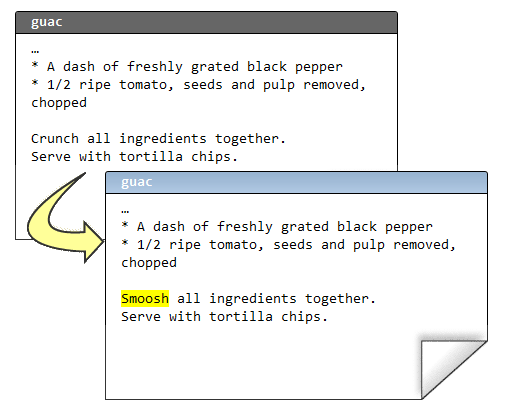
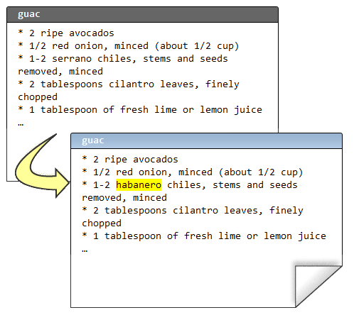
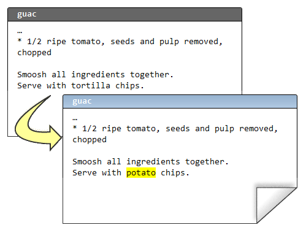

.. epigraph::

    **使用 Mercurial 的一个好处是团队能够进行协作开发. Mercurial 让你能够独立工作, 又能随时合并变更.**

============
团队协作
============

用 Mercurial 进行协作开发最常用的方法是建立一个中央库, 同时我们各自的 PC 上也都有一份私有版本库. 我们可以把中央库当作交换中心, 相当于我们聚在一起交换我们所做变更的地方.

.. image:: _images/02-repo.png

``hg serve``
-------------

.. note:: ``hg serve``
    
    启动一个 WEB 服务器以便当前版本库能通过 Internet 访问

快速建立中央库最简陋的方法是使用 Mercurial 内置的 WEB 服务器 --  你所作的仅仅是用 **hg init** 创建一个版本库, 然后用 **hg serve** 启动 WEB 服务. 默认情况下, 它会占用 8000 端口.

::

    C:\> mkdir CentralRepo
    
    C:\> cd CentralRepo
    
    C:\CentralRepo> hg init
    
    C:\CentralRepo> hg serve

这台 PC 的主机名是 **joel.example.com**, 我只要用浏览器登录 **http://joel.example.com:8000/** 便可看到服务器已经启动并正在运行, 虽然版本库还是空白一片.

.. image:: _images/02-web.png

``hg clone``
-------------

.. note:: ``hg clone``
    
    获取版本库的完整副本

一旦中央 WEB 服务器开始服务, 我可以从服务器 *克隆 (clone)* 版本库到我的个人 PC 自主使用. 这个版本库现在还是空的, 所以我克隆后得到的也是空白库.

::

    C:\Users\joel> hg clone http://joel.example.com:8000/ recipes
    no changes found
    updating to branch default
    0 files updated, 0 files merged, 0 files removed, 0 files unresolved
    
    C:\Users\joel> cd recipes
    
    C:\Users\joel\recipes> dir
     Volume in drive C has no label.
     Volume Serial Number is 84BD-9C2C
    
     Directory of C:\Users\joel\recipes
    
    02/08/2010  02:46 PM    <DIR>          .
    02/08/2010  02:46 PM    <DIR>          ..
    02/08/2010  02:46 PM    <DIR>          .hg
                   0 File(s)              0 bytes
                   3 Dir(s)  41,852,125,184 bytes free

现在, 我们新建一个名为 **guac** 的文件, 记录本人有名的鳄梨酱配方.

**guac**::

    * 2 ripe avocados
    * 1/2 red onion, minced (about 1/2 cup)
    * 1-2 serrano chiles, stems and seeds removed, minced
    * 2 tablespoons cilantro leaves, finely chopped
    * 1 tablespoon of fresh lime or lemon juice
    * 1/2 teaspoon coarse salt
    * A dash of freshly grated black pepper
    * 1/2 ripe tomato, seeds and pulp removed, chopped
    
    Crunch all ingredients together.
    Serve with tortilla chips.

我将添加这个文件, 并作为我的第一个官方版本提交:

::

    C:\Users\joel\recipes> hg add
    adding guac
    
    C:\Users\joel\recipes> hg commit

以及提交摘要:

.. image:: _images/02-commit0.png

现在, 我要编辑这个文件, 做些小改动, 这样版本库里就会留下些历史记录了.

接着提交这次变更::

    C:\Users\joel\recipes> hg status
    M guac
    
    C:\Users\joel\recipes> hg diff guac
    diff -r c1fb7e7fbe50 guac
    --- a/guac      Mon Feb 08 14:50:08 2010 -0500
    +++ b/guac      Mon Feb 08 14:51:08 2010 -0500
    @@ -7,5 +7,5 @@
     * A dash of freshly grated black pepper
     * 1/2 ripe tomato, seeds and pulp removed, chopped
    
    -Crunch all ingredients together.
    +Smoosh all ingredients together.
     Serve with tortilla chips.
    
    C:\Users\joel\recipes> hg com -m "Change crunch to smoosh"
    
    C:\Users\joel\recipes> hg log
    changeset:   1:a52881ed530d
    tag:         tip
    user:        Joel Spolsky <joel@joelonsoftware.com>
    date:        Mon Feb 08 14:51:18 2010 -0500
    summary:     Change crunch to smoosh
    
    changeset:   0:c1fb7e7fbe50
    user:        Joel Spolsky <joel@joelonsoftware.com>
    date:        Mon Feb 08 14:50:08 2010 -0500
    summary:     Initial version of guacamole recipe

注意我这次提交的时候, 头一次使用了 **-m** 参数. 这只是在命令行下, 不通过编辑器输入提交摘要的一个方法.

OK, 我们在哪儿? 到目前为止, 我能访问中央库, 还克隆了一份本地库. 我已经做了两次变更并提交到本地库, 但是这些变更只存在于我的本地库 -- 它们还没有进入中央库. 所以现在的状况是:

.. image:: _images/02-repo-2.png

``hg push``
-------------

.. note:: ``hg push``
    
    把一个版本库的新增变更推送到另一个版本库

现在我将使用 **hg push** 命令, 把我的变更从我的本地库 **推入** 到中央库::

    C:\Users\joel\recipes> hg push
    pushing to http://joel.example.com:8000/
    searching for changes
    ssl required

我靠, 居然报错. 我暂时不考虑随便运行一个 WEB 服务器, 还允许任何人把他们那愚蠢的变更推到中央库所带来的安全问题. 忍耐一小会; 我要去配置一下服务器, 让任何人都可以为所欲为. 这需要编辑一下 ``.hg\hgrc`` 文件. 

``.hg\hgrc``::

    [web]
    push_ssl=False
    allow_push=*

显然, 这是很危险的, 但是如果你处在一个安全的局域网环境下工作, 有一个优秀的防火墙, 而且你信任局域网中的每个人, 这样的话是安全的. 否则, 你可能要去看看手册中关于安全的进阶章节.

好, 我们重新启动服务器::

    C:\CentralRepo> hg serve

现在我应该可以 push 变更集了::

    C:\Users\joel\recipes> hg push
    pushing to http://joel.example.com:8000/
    searching for changes
    adding changesets
    adding manifests
    adding file changes
    added 2 changesets with 2 changes to 1 files

Yay! 现在的状况变成这样了:

.. image:: _images/02-repo-3.png

我知道你在想什么. 你在想, "喔呦, Joel, 太奇怪了. 为什么这些版本库里包含的是 *变更* 而不是 *文件* 呢? **guac** 文件在哪儿?"

是的, 很诡异. 但这就是分布式版本控制的工作方式. 版本库就是一个包含大量变更的堆栈. 把变更想象成一块干净的透明毯子. 现在你有一捆这样的透明毯子, 你把它们按顺序堆叠起来, 最新变更放在最上面, 然后从上往下俯视, 注意! -- 你看到的便是当前最新版本的文件. 随着你从栈顶慢慢掀走透明毯, 你会看到越来越老的版本.

现在, 我们可以通过浏览器感受一下中央版本库:

.. image:: _images/02-web-2.png

正如你所预料的那样.

现在, 我想让 Rose 帮我一起写配方. ... (译注: 有意略掉了一段, 不影响教程内容) ...

.. code-block:: bash

    C:\Users\rose> hg clone http://joel.example.com:8000/ recipes
    requesting all changes
    adding changesets
    adding manifests
    adding file changes
    added 2 changesets with 2 changes to 1 files
    updating to branch default
    1 files updated, 0 files merged, 0 files removed, 0 files unresolved

Rose 使用 **hg clone** 命令获取了一份完整的版本库副本. **hg clone** 接受两个参数: 版本库的 URL 和本地副本的目录. Rose ``clone`` 到她本地的 **recipes** 目录.

.. code-block:: bash

    C:\Users\rose> cd recipes
    
    C:\Users\rose\recipes> dir
     Volume in drive C has no label.
     Volume Serial Number is 84BD-9C2C
    
     Directory of C:\Users\rose\recipes
    
    02/08/2010  03:23 PM    <DIR>          .
    02/08/2010  03:23 PM    <DIR>          ..
    02/08/2010  03:23 PM    <DIR>          .hg
    02/08/2010  03:23 PM               394 guac
                   1 File(s)            394 bytes
                   3 Dir(s)  41,871,872,000 bytes free
    
    C:\Users\rose\recipes> hg log
    changeset:   1:a52881ed530d
    tag:         tip
    user:        Joel Spolsky <joel@joelonsoftware.com>
    date:        Mon Feb 08 14:51:18 2010 -0500
    summary:     Change crunch to smoosh
    
    changeset:   0:c1fb7e7fbe50
    user:        Joel Spolsky <joel@joelonsoftware.com>
    date:        Mon Feb 08 14:50:08 2010 -0500
    summary:     Initial version of guacamole recipe

注意键入 **hg log** 后她看到的是整个历史记录. 实际上她下载了整个版本库, 包括所有完整的历史记录.

Rose 打算做些改动, 然后提交至版本库:

注意, 即使服务器没在运行, 她仍然可以做提交操作: 提交动作完全发生在本机上.

.. code-block:: bash

    C:\Users\rose\recipes> hg diff
    diff -r a52881ed530d guac
    --- a/guac      Mon Feb 08 14:51:18 2010 -0500
    +++ b/guac      Mon Feb 08 15:28:57 2010 -0500
    @@ -1,6 +1,6 @@
     * 2 ripe avocados
     * 1/2 red onion, minced (about 1/2 cup)
    -* 1-2 serrano chiles, stems and seeds removed, minced
    +* 1-2 habanero chiles, stems and seeds removed, minced
     * 2 tablespoons cilantro leaves, finely chopped
     * 1 tablespoon of fresh lime or lemon juice
     * 1/2 teaspoon coarse salt

    C:\Users\rose\recipes> hg com -m "spicier kind of chile"

    C:\Users\rose\recipes> hg log
    changeset:   2:689026657682
    tag:         tip
    user:        Rose Hillman <rose@example.com>
    date:        Mon Feb 08 15:29:09 2010 -0500
    summary:     spicier kind of chile

    changeset:   1:a52881ed530d
    user:        Joel Spolsky <joel@joelonsoftware.com>
    date:        Mon Feb 08 14:51:18 2010 -0500
    summary:     Change crunch to smoosh

    changeset:   0:c1fb7e7fbe50
    user:        Joel Spolsky <joel@joelonsoftware.com>
    date:        Mon Feb 08 14:50:08 2010 -0500
    summary:     Initial version of guacamole recipe

当 Rose 在做修改的时候, 与此同时, 我也可以做些改动.

你会看到我提交之后, 日志显示 #2 变更集和 Rose 的不太一样.

::

    C:\Users\joel\recipes> hg com -m "potato chips. No one can eat just one."

    C:\Users\joel\recipes> hg log
    changeset:   2:4ecdb2401ab4
    tag:         tip
    user:        Joel Spolsky <joel@joelonsoftware.com>
    date:        Mon Feb 08 15:32:01 2010 -0500
    summary:     potato chips. No one can eat just one.

    changeset:   1:a52881ed530d
    user:        Joel Spolsky <joel@joelonsoftware.com>
    date:        Mon Feb 08 14:51:18 2010 -0500
    summary:     Change crunch to smoosh

    changeset:   0:c1fb7e7fbe50
    user:        Joel Spolsky <joel@joelonsoftware.com>
    date:        Mon Feb 08 14:50:08 2010 -0500
    summary:     Initial version of guacamole recipe

我们的版本历史开始分道扬镳.

.. image:: _images/02-repo-4.png

别担心... 很快我们就会看到如何把这些各自奔天涯的变更重新聚集在一起.

``hg outgoing``
-----------------

.. note:: ``hg outgoing``
    
    列出当前版本库等待推送的变更列表

Rose 可以继续离线工作, 只要她愿意, 可以在她的本地版本库中做任何修改, 可以 ``commit``, 也可以 ``revert``. 到了一定阶段, 她想到要把她所做的变更和其他人分享. 她可以键入 **hg outgoing**, 然后得到等待发送到中央库的变更列表. 这个列表就是如果她执行 **hg push** 将会被送出的那些变更.

.. code-block:: bash

    C:\Users\rose\recipes> hg outgoing
    comparing with http://joel.example.com:8000/
    searching for changes
    changeset:   2:689026657682
    tag:         tip
    user:        Rose Hillman <rose@example.com>
    date:        Mon Feb 08 15:29:09 2010 -0500
    summary:     spicier kind of chile

你可以把 **hg outgoing** 想象成: 它只是简单的列出本地库中 *中央库* 没有的那些变更.

好的, Rose 决定推送她的变更.

.. code-block:: bash

    C:\Users\rose\recipes> hg push
    pushing to http://joel.example.com:8000/
    searching for changes
    adding changesets
    adding manifests
    adding file changes
    added 1 changesets with 1 changes to 1 files

现在的状况是这样子的:

.. image:: _images/02-repo-5.png

喝完今天第四杯拿铁咖啡, 我也准备推送我的变更了.

::

    C:\Users\joel\recipes> hg outgoing
    comparing with http://joel.example.com:8000/
    searching for changes
    changeset:   2:4ecdb2401ab4
    tag:         tip
    user:        Joel Spolsky <joel@joelonsoftware.com>
    date:        Mon Feb 08 15:32:01 2010 -0500
    summary:     potato chips. No one can eat just one.

    C:\Users\joel\recipes> hg push
    pushing to http://joel.example.com:8000/
    searching for changes
    abort: push creates new remote heads!
    (did you forget to merge? use push -f to force)

啊哈! 失败鸟! 顺便提一下... 你看到那条消息了吗? 就是提示 **use push -f to force?** 的那条. 那是个极其糟糕的建议. 千万不要使用 **push -f** 来强制推送. 相信我, 你会为此后悔的.

推送失败是因为我们同时做了修改, 所以它们需要做合并操作, 而 Mercurial 很清楚这一点.

我首先需要做的是, 获取中央库中我所没有的所有变更, 以便我进行合并操作.

::

    C:\Users\joel\recipes> hg incoming
    comparing with http://joel.example.com:8000/
    searching for changes
    changeset:   3:689026657682
    tag:         tip
    parent:      1:a52881ed530d
    user:        Rose Hillman <rose@example.com>
    date:        Mon Feb 08 15:29:09 2010 -0500
    summary:     spicier kind of chile

    C:\Users\joel\recipes> hg pull
    pulling from http://joel.example.com:8000/
    searching for changes
    adding changesets
    adding manifests
    adding file changes
    added 1 changesets with 1 changes to 1 files (+1 heads)
    (run 'hg heads' to see heads, 'hg merge' to merge)

``(+1 heads)`` 的提示有些莫名其妙. 这是因为我的本地库里, 原本只有 3 个变更整齐的堆叠着, 现在却成了个双头怪, 两个不同的变更并行堆叠在栈顶, 看上去很不牢靠:

.. image:: _images/02-repo-6.png

现在在我的本地库有两个版本... 我的那份::

    C:\Users\joel\recipes> type guac
    * 2 ripe avocados
    * 1/2 red onion, minced (about 1/2 cup)
    * 1-2 serrano chiles, stems and seeds removed, minced
    * 2 tablespoons cilantro leaves, finely chopped
    * 1 tablespoon of fresh lime or lemon juice
    * 1/2 teaspoon coarse salt
    * A dash of freshly grated black pepper
    * 1/2 ripe tomato, seeds and pulp removed, chopped

    Smoosh all ingredients together.
    Serve with potato chips.

以及 Rose 的那份:

.. code-block:: bash

    C:\Users\joel\recipes> hg cat -r 3 guac
    * 2 ripe avocados
    * 1/2 red onion, minced (about 1/2 cup)
    * 1-2 habanero chiles, stems and seeds removed, minced
    * 2 tablespoons cilantro leaves, finely chopped
    * 1 tablespoon of fresh lime or lemon juice
    * 1/2 teaspoon coarse salt
    * A dash of freshly grated black pepper
    * 1/2 ripe tomato, seeds and pulp removed, chopped

    Smoosh all ingredients together.
    Serve with tortilla chips.

``hg merge``
-------------

.. note:: ``hg merge``
    
    合并两个版本头

现在我要决定是否合并. 幸运的是, 合并过程很简单.

::

    C:\Users\joel\recipes> hg merge
    merging guac
    0 files updated, 1 files merged, 0 files removed, 0 files unresolved
    (branch merge, don't forget to commit)

    C:\Users\joel\recipes> type guac
    * 2 ripe avocados
    * 1/2 red onion, minced (about 1/2 cup)
    * 1-2 habanero chiles, stems and seeds removed, minced
    * 2 tablespoons cilantro leaves, finely chopped
    * 1 tablespoon of fresh lime or lemon juice
    * 1/2 teaspoon coarse salt
    * A dash of freshly grated black pepper
    * 1/2 ripe tomato, seeds and pulp removed, chopped

    Smoosh all ingredients together.
    Serve with potato chips.

瞧! **hg merge** 命令把两个版本头合二为一了. 在本例中, 因为我们没有编辑文件的同一行, 所以完全没有冲突, 合并因此也就没有任何障碍.

我依然需要 ``commit``. 这很重要. 如果合并失败了, 我随时可以 ``revert`` 然后重试. 因为我们成功合并, 所以我决定把我的变更提交到中央库.

::

    C:\Users\joel\recipes> hg commit -m "merge"

    C:\Users\joel\recipes> hg log
    changeset:   4:0849ca96c304
    tag:         tip
    parent:      2:4ecdb2401ab4
    parent:      3:689026657682
    user:        Joel Spolsky <joel@joelonsoftware.com>
    date:        Mon Feb 08 16:07:23 2010 -0500
    summary:     merge

    changeset:   3:689026657682
    parent:      1:a52881ed530d
    user:        Rose Hillman <rose@example.com>
    date:        Mon Feb 08 15:29:09 2010 -0500
    summary:     spicier kind of chile

    changeset:   2:4ecdb2401ab4
    user:        Joel Spolsky <joel@joelonsoftware.com>
    date:        Mon Feb 08 15:32:01 2010 -0500
    summary:     potato chips. No one can eat just one.

    changeset:   1:a52881ed530d
    user:        Joel Spolsky <joel@joelonsoftware.com>
    date:        Mon Feb 08 14:51:18 2010 -0500
    summary:     Change crunch to smoosh

    changeset:   0:c1fb7e7fbe50
    user:        Joel Spolsky <joel@joelonsoftware.com>
    date:        Mon Feb 08 14:50:08 2010 -0500
    summary:     Initial version of guacamole recipe

    C:\Users\joel\recipes> hg out
    comparing with http://joel.example.com:8000/
    searching for changes
    changeset:   2:4ecdb2401ab4
    user:        Joel Spolsky <joel@joelonsoftware.com>
    date:        Mon Feb 08 15:32:01 2010 -0500
    summary:     potato chips. No one can eat just one.

    changeset:   4:0849ca96c304
    tag:         tip
    parent:      2:4ecdb2401ab4
    parent:      3:689026657682
    user:        Joel Spolsky <joel@joelonsoftware.com>
    date:        Mon Feb 08 16:07:23 2010 -0500
    summary:     merge

    C:\Users\joel\recipes> hg push
    pushing to http://joel.example.com:8000/
    searching for changes
    adding changesets
    adding manifests
    adding file changes
    added 2 changesets with 2 changes to 1 files

现在中央库和我的本地库是一模一样的:

.. image:: _images/02-repo-7.png

OK, 现在我的本地库包含 Rose 和我的变更, 但是 Rose 却还没有拿到我的变更.

... (译注: 再次有意忽略一段) ...

为此, Rose 需要从中央库取出新增的变更.

.. code-block:: bash

    C:\Users\rose\recipes> hg pull
    pulling from http://joel.example.com:8000/
    searching for changes
    adding changesets
    adding manifests
    adding file changes
    added 2 changesets with 2 changes to 1 files
    (run 'hg update' to get a working copy)

搞定. 现在你可能留意到某些异样, 即使 Rose 已经把新的变更取至她的本地库, *这些变更仍然没有在她的工作目录生效.*

.. code-block:: bash

    C:\Users\rose\recipes> type guac
    * 2 ripe avocados
    * 1/2 red onion, minced (about 1/2 cup)
    * 1-2 habanero chiles, stems and seeds removed, minced
    * 2 tablespoons cilantro leaves, finely chopped
    * 1 tablespoon of fresh lime or lemon juice
    * 1/2 teaspoon coarse salt
    * A dash of freshly grated black pepper
    * 1/2 ripe tomato, seeds and pulp removed, chopped

    Smoosh all ingredients together.
    Serve with tortilla chips.

看到没? 文件没有发生任何变化!

但是她的本地库中某个地方 *的确* 有我的变更...

.. code-block:: bash

    C:\Users\rose\recipes> hg log
    changeset:   4:0849ca96c304
    tag:         tip
    parent:      3:4ecdb2401ab4
    parent:      2:689026657682
    user:        Joel Spolsky <joel@joelonsoftware.com>
    date:        Mon Feb 08 16:07:23 2010 -0500
    summary:     merge

    changeset:   3:4ecdb2401ab4
    parent:      1:a52881ed530d
    user:        Joel Spolsky <joel@joelonsoftware.com>
    date:        Mon Feb 08 15:32:01 2010 -0500
    summary:     potato chips. No one can eat just one.

    changeset:   2:689026657682
    user:        Rose Hillman <rose@example.com>
    date:        Mon Feb 08 15:29:09 2010 -0500
    summary:     spicier kind of chile

    changeset:   1:a52881ed530d
    user:        Joel Spolsky <joel@joelonsoftware.com>
    date:        Mon Feb 08 14:51:18 2010 -0500
    summary:     Change crunch to smoosh

    changeset:   0:c1fb7e7fbe50
    user:        Joel Spolsky <joel@joelonsoftware.com>
    date:        Mon Feb 08 14:50:08 2010 -0500
    summary:     Initial version of guacamole recipe

``hg parent``
-------------------

.. note:: ``hg parent``
    
    显示工作目录当前的变更集

变更只不过没有在工作目录下生效. 这是因为她还是在基于 ``changeset #2`` 工作. 你可以使用 "parent" 命令确认::

    C:\Users\rose\recipes> hg parent
    changeset:   2:689026657682
    user:        Rose Hillman <rose@example.com>
    date:        Mon Feb 08 15:29:09 2010 -0500
    summary:     spicier kind of chile

Mercurial 太友好了. 每次 ``pull`` 都是安全的; 它所做的只是让我们得到其他人的变更. 我们可以随时切换到新的变更下工作.

记住, 不带任何参数的 **hg up** 命令会把工作目录更新到 *tip* (始终为最新的变更集), 本例中, *tip* 是 4::

    C:\Users\rose\recipes> hg up
    1 files updated, 0 files merged, 0 files removed, 0 files unresolved

    C:\Users\rose\recipes> type guac
    * 2 ripe avocados
    * 1/2 red onion, minced (about 1/2 cup)
    * 1-2 habanero chiles, stems and seeds removed, minced
    * 2 tablespoons cilantro leaves, finely chopped
    * 1 tablespoon of fresh lime or lemon juice
    * 1/2 teaspoon coarse salt
    * A dash of freshly grated black pepper
    * 1/2 ripe tomato, seeds and pulp removed, chopped

    Smoosh all ingredients together.
    Serve with potato chips.

现在, Rose 正在看着合并了所有人改动后的最新版本呢.

如果你作为团队协作的一员, 你的工作流大概会是这个样子:

#. 如果你有一段时间没有更新代码, 你需要获取其他人已经完成的代码:

  * ``hg pull``
  * ``hg up``

#. 修改代码

#. 提交代码 (本地提交)

#. 重复步骤 2~3 直到你的代码完成度还不错, 你决定让其他人都来 "享受" 你的成果

#. 一旦你准备分享你的代码:

  * 用 ``hg pull`` 获得其他所有人的变更 (如果有的话)
  * 用 ``hg merge`` 将这些变更合并到你的代码中
  * 测试! 以确保合并操作没有出乱子
  * ``hg commit`` (合并结果)
  * ``hg push``

小测验
----------

下面的一些操作是学完本章教程后, 你应该要学会的:

#. 建立一个中央版本库, 让团队成员从中央库 ``clone``
#. 把变更推送 (push) 到中央库
#. 从中央库取出 (pull) 变更
#. 合并不同代码提交人的变更

Next
----------

:doc:`接下来, 我们探讨一下如何修正 *錯误* 错误 </fixing>`
